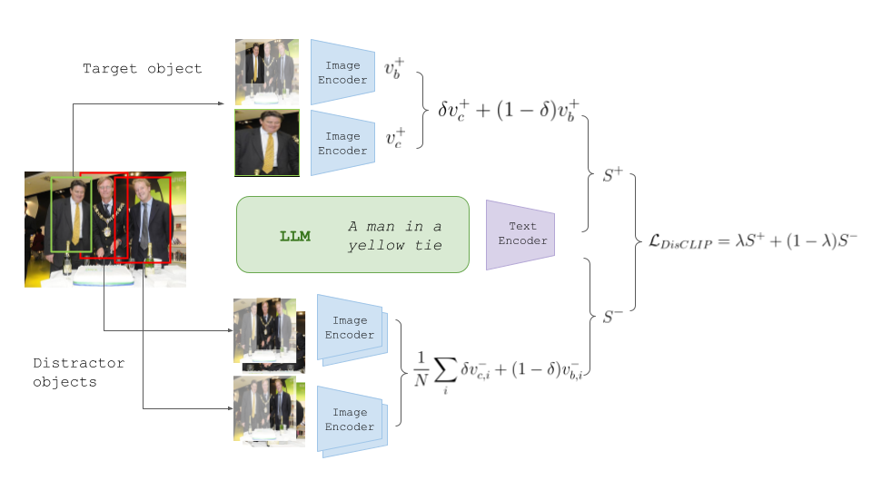

# [DisCLIP: Open-Vocabulary Referring Expression Generation](http://arxiv.org/abs/2305.19108) 
Authors: Lior Bracha*, Eitan Shaar*, Aviv Shamsian, Ethan Fetaya, Gal Chechik
<br><br>


<!-- This repository contains code, models, and other related resources of our paper [DisCLIP: Open-Vocabulary Referring Expression Generation](http://arxiv.org/abs/2305.19108). -->
<!-- <a href='#disclip-reg'>Inference demo </a> [  ] -->

## News 
<!-- [2023/05/06] New options for image captioning backbone   -->
<!-- [2023/05/06] Prompt GPT with visual token.   -->
<!-- [2023/05/06] Added options for online computation of embeddings -->
[2023/05/06] Added controls for sentences lengths  
[2023/05/06] DisCLIP is publicly released!   
<br>

## Environment Setup
Run ``pip install -r requirements.txt`` or follow instructions in [``env.md``](env.md)

## Data 

1. Download [refexp annotations](https://chechiklab.biu.ac.il/~brachalior/projects/disclip/data) and save under `data/anns`
2. Download the [refCOCO/g/+ images](http://images.cocodataset.org/zips/train2014.zip) and unzip it (or create symlink) to `data/images/refcoco`  
3. Download the [refclef images](https://bvisionweb1.cs.unc.edu/licheng/referit/data/images/saiapr_tc-12.zip) and unzip it (or create symlink) to `data/images/refclef`    
4. Download the [refGTA images](https://github.com/mikittt/easy-to-understand-REG/tree/master/pyutils/refer2) and unzip it (or create symlink) to `data/images/refgta`  
### 

Create a symlink from image storage location to `data/images/{dataset}` e.g.
```
ln -s /path/to/coco/images/ data/images/refcoco
```

## Usage
```
python run.py --dataset refcoco+ --split testa --speaker disclip --listener reclip
```

## Citation
If you find our paper and resources useful, please cite our paper.

```bibtex
@article{bracha2023disclip,
  title={DisCLIP: Open-Vocabulary Referring Expression Generation},
  author={Bracha, Lior and Shaar, Eitan and Shamsian, Aviv and Fetaya, Ethan and Chechik, Gal},
  journal={arXiv preprint arXiv:2305.19108},
  year={2023}
}

```

